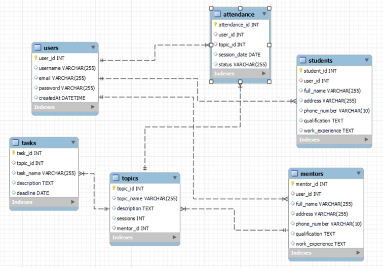

# **Database- Day -2: MySQL**

# **Design DB model for Guvi Zen class**

 I have created for  student table.

## **procedure:-**

Step 1: Open file manager to create new file[Zen DBmodel] -> to then open cmd->code . -> then open vs code.

Step 2: Then create file [DBmodel.md]

step 3: Then poen mysql workbanch and to create Student table.

step 4: Then step by step ( copy and paste ) the answer for [DBmodel.md] file

step 5: Then create diagram 

step 6: Then we can see the task github [https://github.com/Gsara3497/fsdwdtdb-59.git].